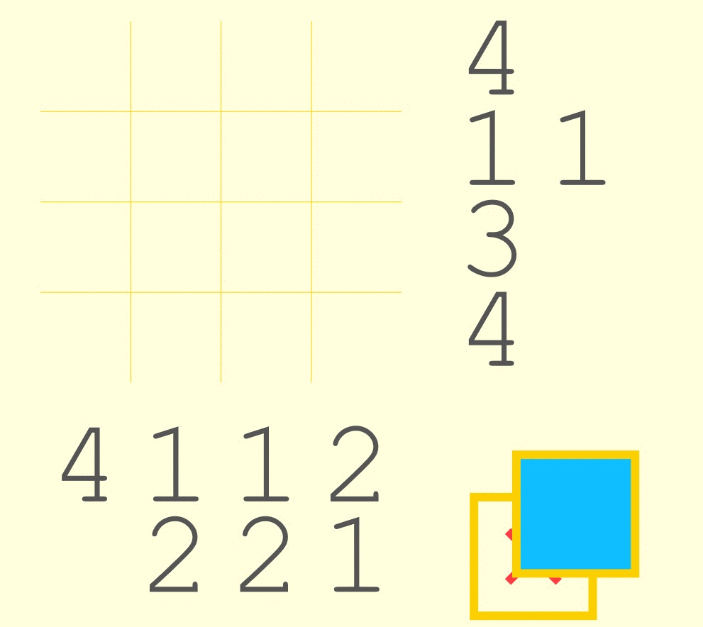

# 🛋 2P Logic Puzzles 🎮

This repo contains is a multiplayer nonogram or Picross-like game that supports up to 4 players, designed specifically for fun and challenging puzzle-solving sessions right from your couch! This game is fully compatible with Xbox One controllers and is crafted using pure TypeScript for smooth, responsive gameplay.



## 🚀 Quick Start

### [🎲 Play It Now @ CouchPicross.com](https://couchpicross.com/) 

Jump right into the action and start solving puzzles with your friends!

## 💻 For Developers

### 📦 Install & Build

To set up your development environment and build the project, run the following commands:

```bash
npm install
npm run-script build
```

### 🔄 Live Development

For a live development server that updates as you make changes, use:

```bash
npm start
```

### 🔗 More Info

- [📚 API Documentation](API.md)

Dive deeper into the game's architecture and learn how to extend or modify it to your liking.

### Known Issues

* Controller D-Pad does not work on Firefox (but does on Edge and Chrome)
